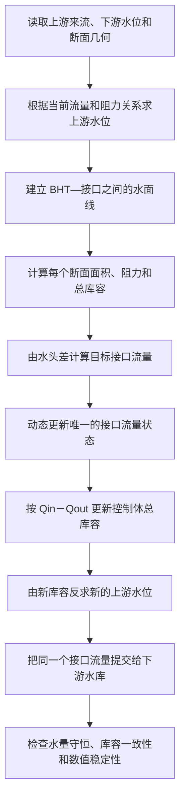

# BHT—SJ 宏观控制体技术方案完整说明

更新时间：2026-07-21
适用分支：`codex/w2-hydro-v24-interface-conservation`
对应实现范围：V24—V42

## 一、结论摘要

这次改动不是简单地“调一个水位参数”，而是把 BHT—SJ 上游河段重新定义成一个守恒的水动力控制体，使“流入多少水、流出多少水、河段里存了多少水、水位因此升降多少”成为一套闭合的物理计算。

目前形成的方案是：

- 把模型第 1 条支流的第 2～27 号河段作为一个整体，即“BHT—SJ 宏观控制体”。
- 在第 28 号河段设置它与下游水库模型的唯一耦合接口。
- 使用现有真实断面几何，计算水位、过水面积、库容、阻力和流量。
- 用一个工程等效阻力参数 `NEFF` 表示这段约 23.83 km 河道未被模型精确描述的综合阻力。
- `0.0725` 是 V38—V41 原窗口的可复现参考值，`0.070～0.075` 是该窗口内支持的工程等效区间；V42 已证明它们不是跨年、跨工况的通用参数。
- 所有水量通过唯一接口流量传递，不增加水、不删除水、不重复计算水。
- 功能默认关闭，因此不提供配置文件时，旧模型结果完全不变。
- 54 天完整模拟和严格留出验证中，BHT 水位误差下降约 70%，BHT—XLD 总水头误差下降约 81%，其他站点只有约 3%～4% 的轻微变化。
- 这个结果说明方案在原 2021 窗口内有效，但 V42 的 2020—2025 组件验证发现明显工况依赖：低流量+低水位所需等效阻力远小于高流量工况。因此 `0.0725` 仍然只是工程参考量，不是已经识别出的真实河床糙率，也不能默认启用。

## 二、我们究竟在解决什么问题

### 2.1 模型把河道切成很多小段

可以把整个河道想象成一串连接起来的水槽。

模型中的每一小段称为一个 **segment，河段或计算单元**。河水从上游单元流到下游单元，最后进入水库主体。

本项目中的几个关键位置大致是：

- BHT：上游，接近第 2 号河段。
- SJ：位于第 26 号河段附近。
- 第 28 号河段：接近 BR2 支流汇入口，是一个重要边界。
- YMT、XLD：继续向下游，属于水库主体。

因此，从 BHT 到 SJ 附近，并不是一个普通的水库单元，而更像是一段较长的上游河道—库尾过渡区。

### 2.2 原模型的主要问题不是“平均水位完全不对”

原模型最大的问题是：

> 当流量变化时，BHT 上游水位的变化幅度太小，模型表现得过于僵硬。

例如真实情况中，上游来水增加时：

- 河道阻力增大；
- 为了把更多水推向下游，上游必须形成更大的水位差；
- BHT 水位应该明显上升。

但旧模型对这种“流量增大 → 上游水位抬升”的响应不足。

通俗地说，真实河道像一条长、粗糙、形状不断变化的水道；旧模型却近似把它表现成了一段过短、过顺滑、储水特性也不够准确的通道。

于是产生了两个典型现象：

- BHT 水位误差很大；
- 从 XLD 到 BHT 的整体水面坡度明显偏小。

这不是单纯给 BHT 水位加一个常数就能解决的问题。因为加常数只能平移水位，不能修复“流量变化时水位响应太弱”这个动态问题。

## 三、为什么不能直接调糙率或者强行修正水位

一开始看起来最简单的办法有三种。

### 3.1 给 BHT 水位加一个修正值

例如：

\[
H_{\text{新}}=H_{\text{旧}}+1.5\text{ m}
\]

这种办法可以暂时让平均水位看起来更接近观测，但它没有物理意义：

- 流量小时也加 1.5 m；
- 流量大时还是加 1.5 m；
- 没有解释多出来的水从哪里来；
- 水位变了，库容和下游流量却没有相应变化。

因此这是“改输出”，不是“改模型”。

### 3.2 只把某几个小河段的糙率调大

这条路线我们实际检查过。

问题是 BHT—SJ 是一段二十多公里长的整体响应，观测并不能告诉我们每一个内部小河段各自应该使用什么参数。若分别调整十几个局部糙率，就会出现：

- 参数数量多于有效观测信息；
- 很多不同参数组合都能得到类似结果；
- 无法判断哪一组参数是真实的；
- 容易把误差从一个站点转移到另一个站点；
- 模型可能只对当前这一次过程有效。

这种情况在模型研究中称为 **不可识别性**：结果能拟合，但无法唯一识别每个参数。

### 3.3 让上游用一个流量，下游再用另一个流量

旧方案中曾有类似的结构性风险：上游河段认为自己排出了一个流量，而水库边界接收的可能是经过衰减或重新计算的另一个流量。

例如：

- 上游说流出了 100 m³/s；
- 下游只收到 90 m³/s；
- 中间的 10 m³/s 没有进入任何储水单元。

这等于水在模型中凭空消失。

所以我们的最终原则是：

> 接口处只能存在一个被正式提交的流量，上游的流出量必须严格等于下游的流入量。

## 四、最终方案：把 BHT—SJ 视为一个“宏观控制体”

### 4.1 什么是控制体

控制体可以理解为在地图上画一个盒子，把一段河道包起来。

对于这个盒子，我们只关心三件事：

1. 从上游流进来多少水；
2. 从下游流出去多少水；
3. 盒子内部的总水量增加或减少了多少。

这就是水量守恒：

\[
\frac{dV}{dt}=Q_{\text{in}}-Q_{\text{out}}
\]

离散到每一个模型时间步：

\[
V_{\text{new}}
=
V_{\text{old}}
+
\Delta t
\left(
Q_{\text{in}}-Q_{\text{out}}
\right)
\]

其中：

- \(V\)：河段内储存的水量，单位 m³；
- \(Q_{\text{in}}\)：上游流入量，单位 m³/s；
- \(Q_{\text{out}}\)：流向下游水库的流量；
- \(\Delta t\)：本次计算持续多少秒。

它很像银行账户：

\[
\text{新余额}
=
\text{旧余额}
+
\text{收入}
-
\text{支出}
\]

水位之所以升高，不是因为程序强制它升高，而是因为流入量暂时大于流出量，河段内部积存了更多水。

### 4.2 为什么选择第 2～27 号河段

最终配置为：

```text
tail_domain.opt
1 26
```

以及：

```text
tail_macro_active.opt
1 28 0.0725
```

其实际含义是：

- 宏观控制体拥有第 2～27 号河段；
- 第 28 号河段是与下游模型交接的位置；
- 使用 `0.0725` 作为工程等效阻力参数。

选择第 28 号河段作为接口的关键原因是：这里接近 BR2 支流汇入口。

如果宏观控制体跨过这个汇入口，就必须同时处理：

- BR2 带来的额外水量；
- 温度；
- 水质组分；
- 支流动量；
- 支流与主河道之间的混合。

现有数据不足以严谨完成这些工作。因此，我们把控制体停在汇流点之前，使质量守恒边界保持清晰。

### 4.3 河段所有权只能属于一方

第 2～27 号河段属于宏观控制体之后，下游水库求解器不能再把这些河段当成自己的储水单元。

否则会发生双重计算：

- 宏观控制体计算了一次库容；
- 水库主体又计算了一次相同库容；
- 同一立方米水被记账两次。

因此我们建立了“排他所有权”：

- 第 2～27 号河段：宏观控制体负责；
- 第 28 号及其下游：水库模型负责；
- 接口流量是两者之间唯一的水量交换。

## 五、模型内部如何从流量计算水位

这是整个方案最核心的水动力部分。

### 5.1 水为什么会从上游流向下游

水流动的根本动力是水位差，也称为 **水头差**。

如果：

- 上游水位为 \(W_{\text{UP}}\)；
- 下游水位为 \(W_{\text{DN}}\)；

那么可用水头为：

\[
\Delta H=W_{\text{UP}}-W_{\text{DN}}
\]

水位差越大，推动水流的能力通常越强；河道阻力越大，在同样的水位差下流量越小。

这类似于：

- 电压差推动电流；
- 水压差推动管道流量；
- 高处的物体具有更大的重力势能。

### 5.2 模型没有把 BHT—SJ 简化成一个矩形水槽

我们保留了每个真实计算断面的几何信息。

对于给定水位，程序会在每个断面计算：

- 过水面积 \(A\)；
- 湿周 \(P\)，即水与河床和河岸接触的边界长度；
- 水力半径 \(R\)。

水力半径定义为：

\[
R=\frac{A}{P}
\]

它反映一个断面对水流是否“宽敞”。

一般来说：

- 面积越大，越容易通过水；
- 湿周越长，水与河床接触越多，摩擦越大；
- 水力半径越大，相同流量下阻力通常越小。

### 5.3 河道阻力计算

方案采用与 Manning 公式相似的阻力表达方式。

对每一个断面，单位长度阻力系数近似为：

\[
r(x)=
\left[
\frac{n_{\text{eff}}}
{A(x)R(x)^{2/3}}
\right]^2
\]

然后沿整段河道积分：

\[
R_{\text{fric}}
=
\int r(x)\,dx
\]

代码中使用梯形积分，把相邻断面的阻力平均后乘以它们之间的距离。

此外还考虑上下游断面流速差带来的速度水头：

\[
R_{\text{vel}}
=
\frac{1/A_{\text{DN}}^2-1/A_{\text{UP}}^2}{2g}
\]

最终综合系数为：

\[
R_{\text{total}}
=
R_{\text{fric}}+R_{\text{vel}}
\]

流量可写成：

\[
Q=
\sqrt{
\frac{W_{\text{UP}}-W_{\text{DN}}}
{R_{\text{total}}}
}
\]

直观理解：

- 水位差越大，流量越大；
- 断面越宽、越深，流量越容易通过；
- `NEFF` 越大，综合阻力越大；
- 对于相同流量，阻力越大，就需要更大的上下游水位差。

这正是原模型在 BHT 附近缺失的效应：高流量时，上游需要积累更高的水位才能推动水流通过较长的库尾河段。

核心流量实现位于 `w2source_v455_2_11_2026/w2_main.f90` 的 `COMPUTE_TAIL_PROFILE_LINK_FLOW`。

## 六、内部水面和储水量如何计算

### 6.1 不能只计算上下游两个水位

若只知道 BHT 和接口水位，还需要知道中间二十多公里河道中的水面是什么形状，才能计算总库容。

当前方案采用距离加权的线性水面：

\[
W(x)
=
W_{\text{UP}}
+
\frac{x}{L}
\left(
W_{\text{DN}}-W_{\text{UP}}
\right)
\]

也就是说，水位从上游到下游按距离平滑过渡。

这不是在声称真实水面一定完全是直线，而是选择了一个：

- 参数最少；
- 可解释；
- 稳定；
- 能使用所有真实断面；
- 不需要虚构内部观测信息

的最小正确表达。

### 6.2 库容计算

在每个断面上：

1. 根据当前水位计算过水面积；
2. 乘以该河段代表长度；
3. 将所有河段体积加起来。

即：

\[
V
=
\sum_i A_i(W_i)\Delta x_i
\]

这使库容来自真实断面几何，而不是用一个人为比例对旧库容进行缩放。

对应实现位于 `w2source_v455_2_11_2026/w2_main.f90` 的 `TAIL_PROFILE_VOLUME`。

### 6.3 已知库容后怎样反推水位

水量守恒给出的是新库容：

\[
V_{\text{new}}
=
V_{\text{old}}
+
\Delta t(Q_{\text{in}}-Q_{\text{out}})
\]

但模型最终需要的是水位。

因此程序要寻找一个上游水位，使按照断面几何计算出来的库容恰好等于 \(V_{\text{new}}\)。

这个问题通过 **二分法** 求解。

二分法可以理解为猜数字：

1. 先确定水位可能所在的上下范围；
2. 取中间水位；
3. 计算该水位对应的库容；
4. 若库容太大，就降低水位上界；
5. 若库容太小，就提高水位下界；
6. 重复，直到误差足够小。

对应实现位于 `w2source_v455_2_11_2026/w2_main.f90` 的 `INVERT_TAIL_PROFILE_STORAGE`。

这个过程保证：

> 最终水位和最终库容来自同一套断面几何，不会出现“水位说有这么多水，库容却说是另一回事”的矛盾。

## 七、为什么流量不会瞬间跳变

真实河道具有惯性和传播时间。

如果上游入流突然从 1,000 m³/s 增加到 5,000 m³/s，下游接口流量通常不会在同一瞬间也变成 5,000 m³/s。水位波需要沿河道传播，河段中间会先储存一部分水。

因此模型保留一个动态流量状态 `TAIL_Q_STATE`：

- 水动力公式给出当前条件下的目标流量；
- 实际提交流量逐步向目标流量靠近；
- 调整速度由已有的传播时间和波速机制控制。

第一次启用宏观控制体时，程序不会从一个任意猜测流量开始，而是使用当前物理入流初始化流量状态。这一修正很重要，否则模拟开始时会出现一次并不存在的突然排水或蓄水。

它类似于开车：

- 油门位置代表目标速度；
- 车辆不会瞬间达到目标速度；
- 车辆速度通过惯性逐步变化。

## 八、每个时间步究竟做了什么

完整过程可以概括为：



这里最关键的是“同一个接口流量”。

程序不会：

- 用一个流量更新上游库容；
- 再用另一个流量给水库；
- 或者在中间悄悄衰减流量。

主动模型入口位于 `w2source_v455_2_11_2026/w2_main.f90`，配置读取和边界检查位于 `w2source_v455_2_11_2026/init-geom.F90`。

## 九、`NEFF=0.0725` 到底是什么

这是最容易被误解的地方。

### 9.1 它不是已经测量出的真实 Manning 糙率

Manning 糙率通常用来描述：

- 河床材料；
- 水草和植被；
- 河岸不规则程度；
- 弯道、滩地等对水流的阻碍。

但我们目前没有足够的资料逐一识别这些因素。

因此这里使用的是：

> 工程等效阻力参数，即用一个统一参数代表整段河道所有未解析阻力的综合效果。

它可能同时吸收了：

- 真实河床和河岸摩擦；
- 断面测量误差；
- 局部收缩和扩张损失；
- 弯道损失；
- 未描述的滩地；
- 水面线采用线性近似产生的误差；
- 模型尺度简化；
- 站点与计算断面位置差异。

所以严谨的表述应当是：

> BHT—SJ 宏观河段在当前模型结构下的工程等效阻力为约 0.0725。

不应该表述成：

> 整个水库的真实 Manning 糙率是 0.0725。

### 9.2 为什么它比原先常见的 0.03 大

因为两者代表的对象不同。

原来的 `0.03` 更接近单个断面的基础河床阻力；现在的 `0.0725` 要代表二十多公里范围内未被显式解析的综合能量损失。

它还包括几何和局部损失，因此数值更大并不意味着真实河床一定异常粗糙。

### 9.3 为什么早期预估曾经接近 0.046，最终却是 0.0725

V37 阶段的约 `0.046` 来自只读预检查：

- 使用旧模型已经算出的内部状态；
- 结合观测水头；
- 估计在该固定状态下需要多大等效阻力。

而 V38 以后是闭环主动计算：

- 阻力改变流量；
- 流量改变储水量；
- 储水量改变水位；
- 水位又反过来改变阻力和流量。

因此，预检查参数和主动耦合后的最终参数不应直接等同。V37 只证明“缺少的是一段宏观阻力”，V38–V41 才识别主动模型中可工作的参数区间。

### 9.4 为什么保留 0.0725，而不是选择误差更小的 0.075

在严格留出验证中，`0.075` 的 BHT 单站 RMSE 略好；但我们仍保留 `0.0725`，原因是：

- 它是验证前选定的中心候选值；
- 它的整体水头偏差更接近零；
- 不是看到验证结果后再追着最低误差重新调参；
- 它位于稳定有效区间中央；
- 对未来不同工况更稳健。

这能避免一种常见错误：不断在同一批数据上寻找最好数字，最终得到一个只适用于这批数据的参数。

## 十、V24 到 V41 各阶段究竟解决了什么

### V21–V23：发现结构问题

当时已经有了上游水动力修正思路，但存在几个根本问题：

- 接口两边可能使用不同流量；
- 流量衰减没有明确的储水去向；
- 最终流量和最终库容没有同步；
- 某些状态是计算猜测，不是真实控制体状态；
- 局部河段库容和总库容关系不严格。

因此不适合直接继续调参。

### V24：建立唯一接口流量

核心改变是：

- 上游流出量等于水库流入量；
- 接口只有一个正式提交的流量；
- 增加接口水量守恒检查。

### V25–V26：明确边界和所有权

解决：

- 哪些河段属于宏观河段；
- 哪些河段属于水库；
- 水量和外部源项不能被重复计算；
- 接口位置必须与配置严格一致。

若配置的主动接口与模型耦合接口不相同，程序会直接停止，而不是带着错误继续运行。

### V27：用真实断面计算库容

从简单近似转为：

- 每个真实断面计算面积；
- 按水面线计算每段库容；
- 总库容可以反解回水位。

### V28：尝试直接激活积分能量关系，但失败

这一版证明：

- 仅把积分水动力公式接入还不够；
- 如果“生成水位的公式”和“生成目标流量的公式”不是同一个闭环，模型会彼此打架；
- 流量和目标水位发生明显偏离。

该路线被明确否定，没有继续在其上调参。

### V29–V31：清理预测—校正状态

模型时间步内部存在预测和校正过程，可以理解为：

1. 先估计下一步状态；
2. 再根据新信息修正；
3. 只接受最终状态。

早期缓存会在预测阶段改变正式流量状态，即使后续校正没有接受该预测。

V30 删除了这种不必要缓存；V31 把预测状态与最终接受状态隔离，并增加完整时间步水量守恒检查。

### V32：实现分段库容严格守恒

取消了会覆盖真实断面几何的过渡缩放，使：

\[
\sum_i V_i = V_{\text{宏观控制体}}
\]

即所有分段水量之和严格等于控制体总水量。

### V33–V34：否定“给每个局部河段单独调参数”

预检查发现，内部接口预测流量可达到正式流量的 1.54～2.54 倍。

同时，仓库中缺少足够的：

- 内部水位站；
- 局部糙率资料；
- 局部结构损失；
- 精细断面属性。

所以多单元独立标定不可识别，风险很高。

### V35：新水位数据改变了问题定位

新增的 12 个水位输入文件通过格式和时间检查后，我们发现：

- 主要误差集中在 BHT/SJ 和 YMT/SJ 对应的宏观河段；
- 越向上游，原模型的水位坡度响应衰减越明显；
- 问题不是最上游几个小单元，而是 BHT—SJ 整体阻力不足。

这是研究方向发生转变的关键证据。

### V36：仅扩大单状态区域仍然失败

单纯把同一个简化状态覆盖到更多河段：

- 某些区间有所改善；
- BHT 反而显著恶化。

这说明只扩大范围会转移误差，不能建立正确的水动力闭环。

### V37：宏观阻力预检查

只读计算显示：

- 旧局部关系低估了所需流量响应；
- 使用基础 `n=0.03` 的整体积分又过于顺畅；
- 观测支持增加 BHT—SJ 宏观阻力。

因此正式提出工程等效参数。

### V38：主动宏观控制体落地

这一版完成：

- 一个宏观控制体；
- 真实断面库容；
- 双向一致的水位—流量关系；
- 动态接口流量；
- 唯一质量通量；
- 启动状态修复；
- 参数短期扫描。

短期结果：

| NEFF | BHT RMSE |
|---:|---:|
| 0.0650 | 1.024 m |
| 0.0700 | 0.732 m |
| 0.0725 | 0.659 m |
| 0.0750 | 0.675 m |

所以选取 `0.0725` 作为平衡中心。

### V39：54 天完整模拟

基线与 `0.0725` 对比：

| 指标 | 原模型 | 新方案 | 变化 |
|---|---:|---:|---:|
| BHT 水位 RMSE | 3.244 m | 0.979 m | 改善 69.80% |
| SJ 水位 RMSE | 1.415 m | 1.245 m | 改善 11.98% |
| XLD→BHT 总水头 RMSE | 2.614 m | 0.542 m | 改善 79.25% |
| YMT→SJ 水头 RMSE | 0.541 m | 0.295 m | 改善 45.57% |
| XLD 水位 RMSE | 0.733 m | 0.757 m | 恶化 3.27% |
| YMT 水位 RMSE | 0.969 m | 1.000 m | 恶化 3.17% |

连续八个周窗口中，BHT 和 SJ 都获得改善，不是某一两天偶然拟合得好。

### V40：严格留出验证

我们排除模拟开始后的前 6.5 天，只检查模型没有用于初始调整的后续时段，共 1,140 个小时样本。

结果：

- BHT RMSE：3.428 → 1.016 m，改善 70.37%；
- 总水头 RMSE：2.745 → 0.529 m，改善 80.74%；
- SJ 改善 10.67%；
- XLD 和 YMT 只恶化约 3%；
- 低流量、中流量、高流量均改善；
- 涨水、平稳、退水阶段均改善；
- 没有守恒警告或库容不一致警告。

这比只看总体 RMSE 更重要，因为它说明方案不是仅在某一种流量状态下有效。

### V41：验证整个参数区间

对 `0.070、0.0725、0.075` 做相同严格验证，三者全部通过预先规定的门槛。

| NEFF | BHT 改善 | 总水头改善 | 其他站最大恶化 |
|---:|---:|---:|---:|
| 0.0700 | 65.96% | 78.53% | 3.69% |
| 0.0725 | 70.37% | 80.74% | 3.61% |
| 0.0750 | 74.20% | 80.57% | 3.65% |

因此可以说：

> 有效的是一个稳定区间，而不是只有某一个非常尖锐、偶然的数字。

详细证据分别记录在：

- [V38 主动宏观控制体说明](../reference/hydrodynamics_limitations/54_v38_active_macro_closure.md)
- [V39 长时段验证](../reference/hydrodynamics_limitations/55_v39_long_window_validation.md)
- [V40 严格留出验证](../reference/hydrodynamics_limitations/56_v40_strict_holdout_regime_validation.md)
- [V41 参数区间验证](../reference/hydrodynamics_limitations/57_v41_parameter_interval_robustness.md)
- [V24—V41 工作记录](V24_WORK_LOG.md)

## 十一、守恒误差为什么不是严格等于零

计算机使用有限精度的二进制数字表示很大的库容。

本模型中：

- 控制体库容约为 \(1.5～1.7\times10^8\) m³；
- 时间步约 1.2 秒；
- 原始守恒残差约 \(1.1\times10^{-8}\) m³/s。

这不是有一部分水真正消失了，而是大型数字在双精度浮点数中进行加减时产生的最小舍入误差。

可以类比为：

- 账本最小只能记录到“分”；
- 余额是几亿元；
- 运算后相差了小于半分钱；
- 这不是业务亏损，而是记录精度的极限。

V41 中程序同时计算：

- 原始残差 `RRAW`；
- 当前数字精度下不可避免的误差边界 `RBOUND`。

有效残差定义为：

\[
R_{\text{effective}}
=
\max
\left(
|R_{\text{raw}}|-R_{\text{bound}},
0
\right)
\]

只有超出机器精度边界的部分才被视为真正的守恒问题。这个修改只改变诊断方法，不改变水位、流量或库容状态。

## 十二、目前已经证明了什么

现有证据可以支持以下判断：

1. **原模型在 BHT—SJ 河段确实缺少足够的宏观阻力和储水响应。**
2. **把这一河段作为单一守恒控制体，比在若干局部河段上零散调参更可识别、更稳定。**
3. **新方案显著修复了 BHT 水位和整体水面坡度。**
4. **改善不是通过牺牲下游站点获得的。** XLD 和 YMT 的误差变化在约 3%～4% 范围，低于预定 10% 上限。
5. **改善覆盖低、中、高流量以及涨水、平稳、退水过程。**
6. **水量守恒、分段库容和总库容一致性都通过检查。**
7. **参数存在稳定区间。** `0.070～0.075` 都有效，不是只有 `0.0725` 一个偶然点。
8. **旧模型仍然可以完全复现。** 默认不开启新功能，关键输出文件哈希值保持一致。
9. **代码已经通过完整缩减版 Fortran 编译以及 55 项 Python 自动测试。**

## 十三、目前还不能证明什么

我们还不能说这个模型已经“最终完成”。

### 13.1 还缺真正独立年份的验证

当前主要证据来自同一个 2021 年过程。

严格留出验证能够避免在同一时间序列上直接追逐误差，但它仍然属于同一年度、相似的边界和运行条件。

最强的验证应该是：

- 固定 `NEFF=0.0725`；
- 不再调参；
- 直接运行另一个年份；
- 检查是否仍然改善。

2023 年目前缺少足够的 BHT 同期水位，因此还不能承担这一作用。

### 13.2 `NEFF` 不是物理糙率鉴定结果

它只能证明：

- 在当前结构和数据下；
- BHT—SJ 河段需要相当于这一量级的综合阻力。

不能据此推断：

- 河床材料是什么；
- 哪个具体河段最粗糙；
- 某个局部构筑物损失是多少。

### 13.3 宏观控制体内部水面仍是简化的

当前内部水面使用线性剖面。

这足以修复总体储水和水头关系，但不能保证第 2～27 号河段每一个内部位置的水位都精确。

如果将来获得 BHT 与 SJ 之间的多个中间水位站，可能会发现：

- 总水头正确；
- 但水头在内部的分配位置仍有偏差。

那时应增加内部水面形状状态，而不是立即增加大量局部糙率参数。

### 13.4 只覆盖到 BR2 汇入口之前

这是有意做出的正确限制。

如果未来要继续向下游扩展，就必须显式处理：

- BR2 支流流量；
- 温度；
- 溶解物质和悬浮物；
- 水质守恒；
- 汇流产生的动量和混合。

不能只是把接口编号改大。

### 13.5 尚不能保证超出已验证流量范围后的表现

当前验证覆盖了本次过程中的低、中、高流量，但无法保证极端洪水、极端低水位或完全不同的水库调度条件仍适用。

## 十四、预期实际效果

如果在当前项目工况下启用：

```text
tail_macro_active.opt
1 28 0.0725
```

预期会看到：

- BHT 水位随流量变化的幅度明显增强；
- 高流量时 BHT 上游水位抬升更加合理；
- BHT—XLD 总水面坡度更接近观测；
- SJ 有中等程度改善；
- YMT、XLD 等下游站点总体变化较小；
- 下游水库主体结构保持原样；
- 不会通过额外水源或人工水位修正获得改善；
- 模型时间步内水量仍然闭合；
- 计算量会略有增加，因为每个时间步需要多次断面积分和二分求解，但目前运行稳定，没有发现不可接受的性能问题。

如果不提供配置文件，预期效果是：

- 完全按照原模型运行；
- 不启用宏观控制体；
- 关键输出与原版本逐字节一致。

## 十五、接下来最合理的工作方向

### 15.1 第一优先级：固定参数，寻找独立验证过程

下一阶段不应继续在 2021 年数据上微调 `0.0725`。

应当收集另一段完整过程，至少包括：

- BHT 水位；
- SJ 水位；
- 上游入流；
- 下游水库水位；
- 水库调度或结构物运行记录；
- 各站统一的高程基准；
- 精确时间戳和站点位置。

然后固定参数直接运行。

如果仍能达到接近当前的改善，就可以把它提升为项目推荐配置。

### 15.2 第二优先级：补充河段内部水位站

最好在 BHT 与 SJ 之间再获得至少一个同步水位站。

它可以帮助回答：

- 水头损失主要集中在哪里；
- 线性水面是否足够；
- 是否需要两个宏观控制体；
- 还是需要一个非线性的内部水面形状。

### 15.3 第三优先级：整理断面和局部阻力资料

有条件时补充：

- 河道实测断面；
- 河床材料；
- 植被和滩地；
- 弯道、桥梁、闸坝、收缩扩张位置；
- 各观测站与模型河段的准确对应关系。

这样才能逐渐把 `NEFF` 中混在一起的误差拆开，提高参数的物理意义。

### 15.4 第四优先级：只有证据要求时才增加第二个控制体

如果独立验证显示：

- BHT—SJ 已经正确；
- 但 SJ—YMT 仍存在独立、稳定、可重复的误差；

才考虑增加第二个控制体。

那时必须同时建立：

- 两个控制体各自的库容；
- 它们之间唯一的质量通量；
- BR2 支流源项；
- 温度和水质组分守恒；
- 两个接口的独立守恒检查。

不建议现在提前增加，因为现有数据尚不足以识别第二组参数。

### 15.5 第五优先级：最终才考虑完整的一维河道求解器

如果将来拥有大量内部断面、多个水位站和流量资料，而宏观控制体仍不能描述内部过程，可以考虑把 BHT—SJ 改造成完整的一维非恒定流模型。

但这会显著增加：

- 状态变量；
- 边界条件要求；
- 参数数量；
- 数值稳定性问题；
- 与水库模型的耦合复杂度。

现阶段没有证据证明必须走到这一步。

## 十六、对当前方案的最终评价

当前方案已经从“局部调参实验”发展成了一套结构上正确、物理上闭合、数值上稳定、能够被关闭和复现、并且得到长期验证支持的模型扩展。

它的主要价值不只是 BHT RMSE 下降约 70%，而是：

- 改善来自正确的物理链路；
- 水位、流量、库容彼此一致；
- 上游和下游共享同一个接口水量；
- 没有用人工水位偏移掩盖问题；
- 没有引入大量不可识别的局部参数；
- 没有跨越尚未处理的支流汇入口；
- 保留了旧模型的精确回退路径；
- 对参数不确定性进行了区间验证。

V42 跨年验证后，当前最准确的定位是：

> 这是一个在原 2021 窗口内有效、结构守恒的工程折中方案；跨年数据不支持把固定 `NEFF=0.0725` 当成跨工况最终生产参数。

因此，后续最正确的动作不是继续追求把 `0.0725` 调到小数点后更多位，也不是利用验证集另选一个固定常数。应先核对 BHT、SJ、YMT 的统一高程基准并补齐完整跨年强迫；如果工况依赖仍存在，再把当前单状态控制体升级为显式包含惯性、内部水面和分段蓄水的保守多状态/一维子模型。完整结果见 [V42 跨年验证](../reference/hydrodynamics_limitations/58_v42_multiyear_cross_validation.md)。
